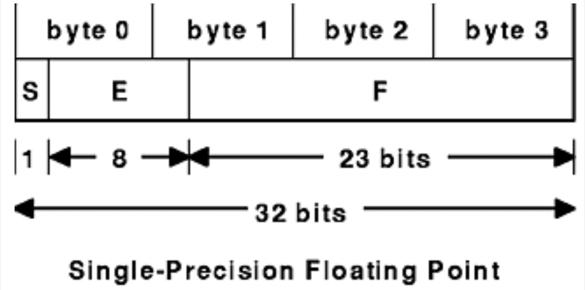

# Insights on the IEEE 754 standard

## 64 bits: Double-Precision Floating Point

The standard requires a double-precision floating point number to be represented with a sign bit (S), 11 bits for the exponent of the number in base 2 with a bias of 1023 (E) and 52 bits for the fractional part of the number's mantissa in base 2 (F).

Let's consider an example: let's represent the number: 0.2 
First of all let's compute the "exponent of the number in base 2":

$$  \left \lfloor log_2(0.2) \right \rfloor  =\left \lfloor log_2(\frac{1}{5}) \right \rfloor =  \left \lfloor -2.3219... \right \rfloor = -3 = 1020-1023 $$

The binary representation of number 1020 with 11 bits is:  $01111111100$
Now for the fractional part of the mantissa in base 2 first write:

$$ \frac{1}{5} = 2^{log_2(\frac{1}{5})} = 2^{\left \lfloor log_2(\frac{1}{5}) \right \rfloor+m} =  2^{-3} * \frac{8}{5} $$

And one may simplify the calculations by noticing that: 

$$ 2^m = \frac{8}{5} = \frac{16}{15}+\frac{8}{15}= \displaystyle  \sum_{i=0}^{\infty}\ \frac{1}{16^i} + \frac{1}{2} \displaystyle  \sum_{i=0}^{\infty}\ \frac{1}{16^i} $$

And hence the binary representation of $2^m$ with 52 bits is: $1001100110011001100110011001100110011001100110011010$
Notice that the last bits do not follow the pattern because rounding was performed.
By noticing that the sign is positive the final binary representation is:

$$\tiny{ 0 | 01111111100 | 1001100110011001100110011001100110011001100110011010}$$  

Where the different fields of the number were separated by the symbol $|$ 
Finally from the binary representation the hexadecimal representation becomes: 0x3fc999999999999a

## 32 bits: Single-Precision Floating Point

The standard requires a double-precision floating point number to be represented with a sign bit (S), 8 bits for the exponent of the number in base 2 with a bias of 127 (E) and 23 bits for the fractional part of the number's mantissa in base 2 (F).

Let's consider the same example: let's represent the number: 0.2 

## 1/3

By following the examples discussed so far it is immediate to write:

$$ \left \lfloor log_2(3) \right \rfloor = -2$$
$$ \frac{1}{3} = \frac{1}{4} * \frac{4}{3} = 2^{-2}\displaystyle \sum_{i=0}^{\infty}\  \frac{1}{2^{2i}}$$

And get the hexadecimal representation as discussed in the thesis
